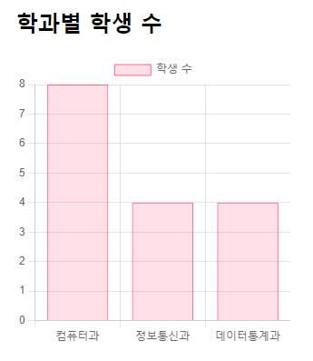
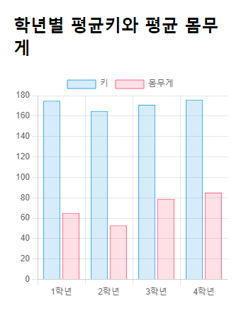

# 방미소 JS 과제

> 2022-03-31

## 문제1
```html
HTML
<div class="subplot">
  <h2>학과별 학생 수</h2>
  <div class="subplot-item">
    <canvas id="mychart1"></canvas>
  </div>
</div>
```

```javascript
JS
/**
 * @fileName    chartHelper.js
 * @author      방미소
 * @description 데이터를 json 형태로 받아 차트로 출력하는 기능을 수행
 */

/***********************************
 * 차트 영역 만들기
***********************************/
const mychart1 = document.querySelector('#mychart1');
const mychart2 = document.querySelector('#mychart2');
const mychart3 = document.querySelector('#mychart3');

/***********************************
 * 문제 1.
 * 학과별 학생 수를 세로 막대그래프로 표시
 ***********************************/
// 각 과목 목록 만들기(초기화)
const dept = {};
student.forEach (stud => {
  const deptName = stud['deptno']
  dept[deptName] = 0;
})

// 각 과목별 학생 수 산출
student.forEach (stud => {
  const deptName = stud['deptno']
  dept[deptName]++;
})

// 과 이름과 학생 수 분리
const department = Object.keys(dept);
const studentCount = Object.values(dept);

// 차트 1
new Chart(mychart1, {
  type: 'bar',
  data: {
      labels: department,
      datasets: [{
          label: '학생 수',
          data: studentCount,
          backgroundColor: [
              'rgba(255, 99, 132, 0.2)'
          ],
          borderColor: [
              'rgba(255, 99, 132, 1)'
          ],
          borderWidth: 1
      }]
  },
  options: {
      maintainAspectRatio: false
  }
});
```


&nbsp;


## 문제2
```html
<div class="subplot">
    <h2>학년에 따른 평균 나이 변화</h2>
    <div class="subplot-item">
      <canvas id="mychart2"></canvas>
    </div>
  </div>
```

```javascript
/***********************************
 * 문제 2.
 * 학년이 올라갈수록 평균 나이가 어떻게 변화하는지 선 그래프로 표시
***********************************/
const ageInfo = {
  '1학년' : [],
  '2학년' : [],
  '3학년' : [],
  '4학년' : []
}

student.forEach( v => {
  // 학생의 출생년도 가져오기
  const birthStr = v['birthdate'];
  const yy = birthStr.substring(0,4);
  
  // 현재 년도와 비교하기
  const today = new Date();
  const toyy = today.getFullYear();

  // 나이 계산(한국 나이)
  const stuAge = toyy - yy + 1;

  // 객체 ageInfo에 나이 저장하기
  if (v['grade'] === 1) {
    ageInfo['1학년'].push(stuAge);
  } else if (v['grade'] === 2) {
    ageInfo['2학년'].push(stuAge);
  } else if (v['grade'] === 3) {
    ageInfo['3학년'].push(stuAge);
  } else if (v['grade'] === 4) {
    ageInfo['4학년'].push(stuAge);
  }
})

// 학생별 평균 나이 구하기
const ageAvg = [];
for(a in ageInfo) {
  let sum = 0;
  ageInfo[a].forEach(v => sum += v)
  let avg = sum / ageInfo[a].length;
  ageAvg.push(avg.toFixed(1))
}

// 차트 2
new Chart(mychart2, {
  type: 'line',
  data: {
      labels: Object.keys(ageInfo),
      datasets: [{
          label: '평균 나이',
          data: ageAvg,
          backgroundColor: [
            'rgba(255, 159, 64, 0.2)'
          ],
          borderColor: [
            'rgba(255, 159, 64, 1)'
          ],
          borderWidth: 1
      }]
  },
  options: {
      maintainAspectRatio: false
  }
});
```


&nbsp;


## 문제3
```html
<div class="subplot">
    <h2>학년별 평균키와 평균 몸무게</h2>
    <div class="subplot-item">
      <canvas id="mychart3"></canvas>
    </div>
  </div>
```

```javascript
/***********************************
 * 문제 3
 * 학년별 평균키와 평균 몸무게 다중 그래프로 표시
***********************************/
const bodyInfo = {
  '1학년' : {'height': [], 'weight' : []},
  '2학년' : {'height': [], 'weight' : []},
  '3학년' : {'height': [], 'weight' : []},
  '4학년' : {'height': [], 'weight' : []}
}

student.forEach(v => {
  // 학생별 키, 몸무게 가져오기
  const stuHeight = v['height'];
  const stuWeight = v['weight'];

  // 객체 bodyInfo에 키, 몸무게 저장하기
  if (v['grade'] === 1) {
    bodyInfo['1학년']['height'].push(stuHeight);
    bodyInfo['1학년']['weight'].push(stuWeight);
  } else if (v['grade'] === 2) {
    bodyInfo['2학년']['height'].push(stuHeight);
    bodyInfo['2학년']['weight'].push(stuWeight);
  } else if (v['grade'] === 3) {
    bodyInfo['3학년']['height'].push(stuHeight);
    bodyInfo['3학년']['weight'].push(stuWeight);
  } else if (v['grade'] === 4) {
    bodyInfo['4학년']['height'].push(stuHeight);
    bodyInfo['4학년']['weight'].push(stuWeight);
  }
});

// 객체 bodyAvg에 학년별 평균 키, 몸무게 저장하기
const bodyAvg = {
  '1학년' : {},
  '2학년' : {},
  '3학년' : {},
  '4학년' : {}
};

let bodyAvgHeight = [], bodyAvgWeight = []

for (b in bodyInfo) {
  let sum = 0;
  // 평균 키 저장
  bodyInfo[b]['height'].forEach (v => {
    sum += v;
  })

  let devide = sum / bodyInfo[b]['height'].length;
  bodyAvgHeight.push(Math.round(devide));

  // 평균 몸무게 저장
  sum = 0;
  bodyInfo[b]['weight'].forEach (v => {
    sum += v;
  })
  
  devide = sum / bodyInfo[b]['weight'].length;
  bodyAvgWeight.push(Math.round(devide));
}

console.log(bodyAvgHeight)


// 차트 3
new Chart(mychart3, {
  type: 'bar',
  data: {
    labels: Object.keys(bodyInfo),
    datasets: [{
        label: '키',
        data: bodyAvgHeight,
        backgroundColor: [
          'rgba(54, 162, 235, 0.2)',
        ],
        borderColor: [
          'rgba(54, 162, 235, 1)',
        ],
        borderWidth: 1
      },
      {
        label: '몸무게',
        data: bodyAvgWeight,
        backgroundColor: [
          'rgba(255, 99, 132, 0.2)',
        ],
        borderColor: [
          'rgba(255, 99, 132, 1)',
        ],
        borderWidth: 1
      }
    ]
  },
  options: {
      maintainAspectRatio: false
  }
});
```
