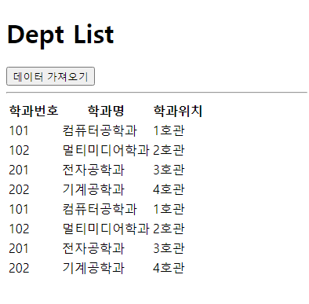

# 방미소 Ajax 과제

> 2022-04-04

## 문제1

```html
<!DOCTYPE html>
<html lang="en">
<head>
  <meta charset="UTF-8">
  <meta http-equiv="X-UA-Compatible" content="IE=edge">
  <meta name="viewport" content="width=device-width, initial-scale=1.0">
  <title>Document</title>
  <style>
    #loading {
      width: 100px;
      height: 100px;
      background-image: url(img/loading.gif);
      background-size: cover;
      background-repeat: no-repeat;
      background-position: center center;
      position: absolute;
      left: 50%;
      top: 50%;
      margin-left: -50px;
      margin-top: -50px;
      z-index: 99999;
      display: none;
    }

    #loading.active {
      display: block;
    }

    dt {
      font-weight: bold;
      margin: 10px 0px;
      font-size: 20px;
    }

    dt:before {
      content:'◎';
      padding-right: 5px;
    }

    dd {
      font-weight:normal;
      margin-bottom: 30px;
      border-left: 5px #d5d5d5 solid;
      padding-left: 15px;
      font-size: 16px;
    }

    #dept-item {
      display: none;
    }
  </style>
</head>
<body>
  <div id="loading"></div>
  <h1>Dept List</h1>

  <button id="btn" type="button">데이터 가져오기</button>

  <hr>

  <table>
    <thead>
      <tr>
        <th>학과번호</th>
        <th>학과명</th>
        <th>학과위치</th>
      </tr>
    </thead>
    <tbody id="list-body"></tbody>
  </table>
  
  <script src="https://cdn.jsdelivr.net/npm/axios/dist/axios.min.js"></script>
  <script>
  document.querySelector('#btn').addEventListener('click', e => {

    const loading = document.querySelector('#loading');
    loading.classList.add('active');

    axios
    .get('http://localhost:3000/department')
    .then((res) => {
      const json = res.data
      console.log(res.data)
      const listBody = document.querySelector('#list-body');

      json.map(v => {
        const {id, dname, loc} = v;
        console.log(id);
        const tr = document.createElement('tr');
        const td1 = document.createElement('td');
        td1.innerHTML = id;

        const td2 = document.createElement('td');
        td2.innerHTML = dname;

        const td3 = document.createElement('td');
        td3.innerHTML = loc;

        tr.appendChild(td1);
        tr.appendChild(td2);
        tr.appendChild(td3);
        listBody.appendChild(tr);
      })
    })
    .catch(e => {
      console.log(e);
      alert(e.msg);
    })
    .finally (() => {
      loading.classList.remove('active');
    })
  });
  </script>
</body>
</html>
```




&nbsp;


## 문제2

```html
<!DOCTYPE html>
<html lang="en">
<head>
  <meta charset="UTF-8">
  <meta http-equiv="X-UA-Compatible" content="IE=edge">
  <meta name="viewport" content="width=device-width, initial-scale=1.0">
  <title>Document</title>
  <style>
    #loading {
      width: 100px;
      height: 100px;
      background-image: url(img/loading.gif);
      background-size: cover;
      background-repeat: no-repeat;
      background-position: center center;
      position: absolute;
      left: 50%;
      top: 50%;
      margin-left: -50px;
      margin-top: -50px;
      z-index: 99999;
      display: none;
    }

    #loading.active {
      display: block;
    }

    dt {
      font-weight: bold;
      margin: 10px 0px;
      font-size: 20px;
    }

    dt:before {
      content:'◎';
      padding-right: 5px;
    }

    dd {
      font-weight:normal;
      margin-bottom: 30px;
      border-left: 5px #d5d5d5 solid;
      padding-left: 15px;
      font-size: 16px;
    }

    #dept-item {
      display: none;
    }
  </style>
</head>
<body>
<div id="loading"></div>
<h1>Dept List</h1>

<button id="btn" type="button">데이터 가져오기</button>

<hr>

<table>
  <thead>
    <tr>
      <th>학과번호</th>
      <th>학과명</th>
      <th>학과위치</th>
    </tr>
  </thead>
  <tbody id="list-body"></tbody>
</table>
  
<script src="https://cdn.jsdelivr.net/npm/axios/dist/axios.min.js"></script>
<script>
  document.querySelector('#btn').addEventListener('click', async (e) => {
    const loading = document.querySelector('#loading');
    const listBody = document.querySelector('#list-body');
    loading.classList.add('active');

    let json = null;

    try {
      json = await axios.get(`http://localhost:3000/department/`)
      // console.log(json)
    } catch (e) {
      console.error(e);
      console.error(e.response.status);
      console.error(e.response.statusText);
      console.error(e.response.data);
      alert(error.response.statusText);
    } finally {
      loading.classList.remove('active');
    }

    if (json != null) {
      // console.log(json.data)
      json.data.map(v => {
        const {id, dname, loc} = v;

        const tr = document.createElement('tr');
        const td1 = document.createElement('td');
        td1.innerHTML = id;

        const td2 = document.createElement('td');
        td2.innerHTML = dname;

        const td3 = document.createElement('td');
        td3.innerHTML = loc;

        tr.appendChild(td1);
        tr.appendChild(td2);
        tr.appendChild(td3);
        listBody.appendChild(tr);
      })

      const {id, dname, loc} = json.data;
      
    }
  });
</script>
</body>
</html>
```


