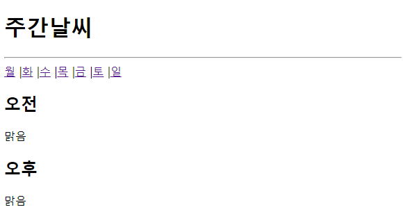
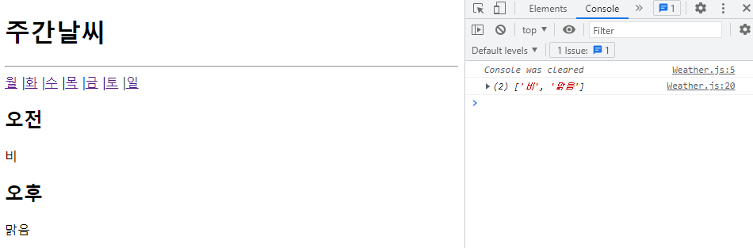
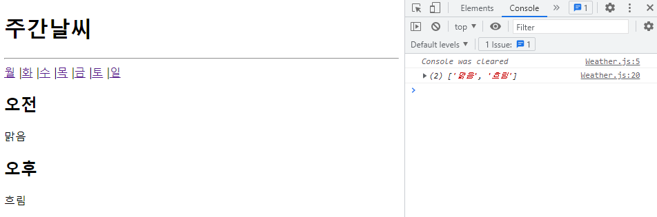

# 방미소 React 연습문제 02
> 2022-04-26

## 문제1

```javascript
import React from "react";
import { useParams } from "react-router-dom";

const Weather = () => {  
  console.clear();

  const param = useParams();
  const day = param.day;
  
  const weather = {
    "mon": ["맑음", "맑음"],
    "tue": ["비", "맑음"],
    "wed": ["맑음", "흐림"],
    "thu": ["맑음", "흐림"],
    "fri": ["흐림", "흐림"],
    "sat": ["비", "맑음"],
    "sun": ["맑음", "맑음"]
  };

  console.log(weather[day])

  return (
    <div>
      <h2>오전</h2>
      <p>{weather[day][0]}</p>
      <h2>오후</h2>
      <p>{weather[day][1]}</p>
    </div>
  )
}

export default Weather;
```

- 셀프 코드리뷰 : 비구조문법에 더 익숙해질 것



