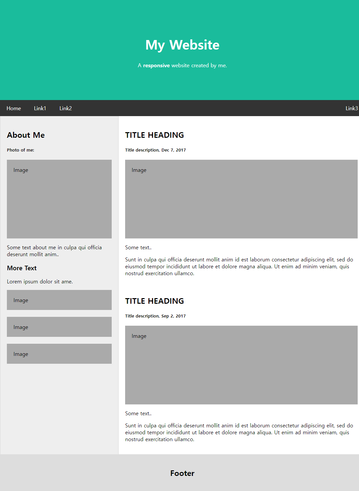

# 방미소 React 연습문제 05
> 2022-04-28



## src

### index.js
```javascript
import React from 'react';
import ReactDOM from 'react-dom/client';
import { BrowserRouter } from 'react-router-dom';

import App from './App';

const root = ReactDOM.createRoot(document.getElementById('root'));
root.render(
  <React.StrictMode>
    <BrowserRouter>
      <App />
    </BrowserRouter>
  </React.StrictMode>
)
```

### App.js
```javascript
import React, { Fragment } from 'react';
import { Helmet } from 'react-helmet';

import Header from './pages/Header';
import Content from './pages/Content';
import Footer from './pages/Footer';

const App = () => {
  return (
    <Fragment>
      <Helmet>
        <link rel="preconnect" href="https://fonts.googleapis.com" />
        <link rel="preconnect" href="https://fonts.gstatic.com" crossorigin />
        <link href="https://fonts.googleapis.com/css2?
        family=Gugi&family=Noto+Sans+KR:wght@100;300;400;500&display=swap"
        rel="stylesheet" />
        <style>
          {`
            * {
              font-family: 'Noto Sans KR';
            } 
            body {
              margin: 0;
              padding: 0;
            }
          `}
          </style>
      </Helmet>

      <Header />
      <Content />
      <Footer />
    </Fragment>
  );
};

export default App;
```
&nbsp;

## pages

### Header.js
```javascript
import React from 'react';
import { NavLink } from 'react-router-dom';
import styled from 'styled-components';

const HeaderContainer = styled.div`
  .header .jumbotron {
    padding: 80px;
    text-align: center;
    background: #1abc9c;
    color: white;
    h1 {font-size: 40px;}
  }

  .navbar {
    overflow: hidden;
    background-color: #333;
    position: sticky;
    top: 0;

    div {
      max-width: 1200px;
      margin: auto;
      display: flex;
      flex-direction: row;
      flex-wrap: nowrap;
      justify-content: flex-start;
    }

    div a {
      display: block;
      color: white;
      text-align: center;
      padding: 14px 20px;
      text-decoration: none;
    }

    a.right {
      margin-left: auto;
    }
  }
`

const Header = () => {
  return (
    <HeaderContainer className='header'>
      <header className='header'>
        <div className='jumbotron'>
          <h1>My Website</h1>
          <p>A <b>responsive</b> website created by me.</p>
        </div>
      </header>
      <nav className='navbar'>
        <div>
          <NavLink to="#">Home</NavLink>
          <NavLink to="#">Link1</NavLink>
          <NavLink to="#">Link2</NavLink>
          <NavLink to="#" className="right">Link3</NavLink>
        </div>
      </nav>
    </HeaderContainer>
  );
};

export default Header;
```

### Content.js
```javascript
import React from 'react';
import styled from 'styled-components';

import Side from '../components/Side';
import Main from '../components/Main';

const ContentContainer = styled.section`
  max-width: 1200px;
  margin: auto;
  background-color: #eee;
  display: flex;
  flex-wrap: nowrap;
  flex-direction: row;

  .side {
    width: 360px;
    flex: none;
    border-left: 1px solid #d5d5d5;
    border-right: 1px solid #d5d5d5;
    .fakeimg:first-of-type {height: 200px;}
  }

  .main {
    flex: 0 1 auto;
    background-color: white;
    border-right: 1px solid #d5d5d5;
    .fakeimg {height: 200px;}
  }

  .container {
    padding: 20px;
  }
  
  .fakeimg {
    background-color: #aaa;
    width: auto;
    padding: 20px;
  }
`

const Content = () => {
  return (
    <ContentContainer className='content'>
      <Side />
      <Main />
    </ContentContainer>
  );
};

export default Content;
```

### Footer.js
```javascript
import React from 'react';
import styled from 'styled-components';

const FooterContainer = styled.footer`
  padding: 20px;
  text-align: center;
  background: #ddd;
`

const Footer = () => {
  return (
    <FooterContainer className='footer'>
      <h2>Footer</h2>
    </FooterContainer>
  );
};

export default Footer;
```

&nbsp;
## component

### Side.js
```javascript
import React from 'react';

const Side = () => {
  return (
    <div className='side'>
      <div className='container'>
        <h2>About Me</h2>
        <h5>Photo of me:</h5>
        <div className="fakeimg">Image</div>
        <p>Some text about me in culpa qui officia deserunt
        mollit anim..</p>
        <h3>More Text</h3>
        <p>Lorem ipsum dolor sit ame.</p>
        <div className="fakeimg">Image</div>
        <br />
        <div className="fakeimg">Image</div>
        <br />
        <div className="fakeimg">Image</div>
      </div>

    </div>
  );
};

export default Side;
```

### Main.js
```javascript
import React from 'react';
import MainItem from './MainItem';

const Main = () => {
  return (
    <div className='main'>
      <div className="container">
        <MainItem 
          subtit="Title description, Dec 7, 2017"
          longText="Sunt in culpa qui officia deserunt mollit anim id
          est laborum consectetur adipiscing elit, sed do eiusmod tempor incididunt
          ut labore et dolore magna aliqua. Ut enim ad minim veniam, quis nostrud
          exercitation ullamco."/>
        <br />
        <MainItem 
          subtit="Title description, Sep 2, 2017"
          longText="Sunt in culpa qui officia deserunt mollit anim id
          est laborum consectetur adipiscing elit, sed do eiusmod tempor incididunt
          ut labore et dolore magna aliqua. Ut enim ad minim veniam, quis nostrud
          exercitation ullamco."/>
      </div>
    </div>
  );
};

export default Main;
```
### MainItem.js
```javascript
import React, { Fragment } from 'react';

const MainItem = ({title, subtit, image, shortText, longText}) => {
  return (
    <Fragment>
      <h2>{title}</h2>
      <h5>{subtit}</h5>
      <div className="fakeimg">{image}</div>
      <p>{shortText}</p>
      <p>{longText}</p>
    </Fragment>
  );
};

MainItem.defaultProps = {
  title: "TITLE HEADING",
  subtit: "Title description",
  image: "Image" ,
  shortText: "Some text.." ,
  longText: "Some text.."
}

export default MainItem;
```