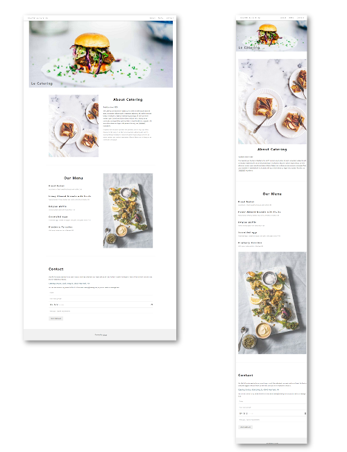
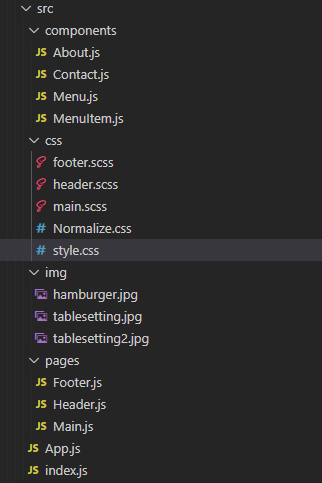

# 방미소 React Clone Coding #01
> 2022-04-29





&nbsp;

## 컴퍼넌트 구조

> Header
> 
> Main 
> - About
> - Menu - MenuItem
> - Contact
> 
> Footer

&nbsp;

### index.js
```javascript
import React from "react";
import ReactDOM from "react-dom/client";

import App from "./App";

const root = ReactDOM.createRoot(document.getElementById("root"));
root.render(
  <React.StrictMode>
    <App />
  </React.StrictMode>
);
```

### App.js
```javascript
import React, { Fragment } from "react";

import Header from "./pages/Header";
import Main from "./pages/Main";
import Footer from "./pages/Footer";

import "./css/Normalize.css";
import "./css/style.css";

const App = () => {
  return (
    <Fragment>
      <Header />
      <Main />
      <Footer />
    </Fragment>
  );
};

export default App;
```

&nbsp;

## pages

### Header.js
```javascript
import React from "react";

import "../css/header.scss";

const Header = () => {
  return (
    <header>
      <div className="inner">
        <div className="title">
          <a href="/">Gourmet au Catering</a>
        </div>
        <nav>
          <ul className="nav-item">
            {/* 단순 페이지 내 이동이므로 NavLink 사용하지 않음 */}
            <li>
              <a href="#about">About</a>
            </li>
            <li>
              <a href="#menu">Menu</a>
            </li>
            <li>
              <a href="#contact">Contact</a>
            </li>
          </ul>
        </nav>
      </div>
    </header>
  );
};

export default Header;
```
``` SCSS
/**
 * 파일명  : header.scss
 * 기능    : Header.js 전용 scss 
*/
header {
  width: 100%;
  background-color: #fff;
  position: fixed;
  top: 0;
  left: 0;
  z-index: 1000;
  box-shadow: 0 3px 5px rgba(155, 155, 155, 0.5);

  .inner {
    width: 100%;
    height: 100%;
    padding: 7px 30px;
    font-size: 13px;
    display: flex;
    align-items: center;
    justify-content: space-between;

    .title {
      height: 100%;
    }

    .nav-item {
      display: none;
      @media only screen and (min-width: 601px) {
        display: flex;
      }
    }

    .nav-item li {
      display: block;
      height: 100%;
    }

    a {
      display: block;
      width: auto;
      padding: 0 15px;
      line-height: 40px;
      text-align: center;
      cursor: pointer;
      &:hover {
        background-color: #ccc;
      }
    }
  }
}
```

### Footer.js
```javascript
import React from 'react';

import '../css/footer.scss';

const Footer = () => {
  return (
    <footer>
      <p>Powered by <a href="https://www.w3schools.com/w3css/default.asp">w3.css</a></p>
    </footer>
  );
};

export default Footer;
```
```scss
/**
 * 파일명  : footer.scss
 * 기능    : Footer.js 전용 scss 
*/
footer {
  width: 100%;
  height: 115px;
  background-color: #f1f1f1;
  text-align: center;
  line-height: 115px;
  font-size: 14px;
  
  a {text-decoration: underline;}
}
```


### Main.js
```javascript
import React from "react";

import About from "../components/About";
import Menu from "../components/Menu";
import Contact from "../components/Contact";
import titleimg from "../img/hamburger.jpg";

import "../css/main.scss";

const Main = () => {
  return (
    <main>
      <section className="section-title">
        
        <h1>Le Catering</h1>
      </section>

      <section className="section-content">
        <About />
        <hr />
        <Menu />
        <hr />
        <Contact />
      </section>
    </main>
  );
};

export default Main;
```
```scss
/**
 * 파일명  : main.scss
 * 기능    : Main.js 전용 scss 
*/
main {
  @media only screen and (min-width: 1455px) {
    margin: 0 auto;
    max-width: 1455px;
  } 
}

/* 상단 이미지 */
.section-title {
  position: relative;

  h1 {
    position: absolute;
    left: 25px;
    bottom: 5px;
    opacity: 0.6;
  }

  img {max-width: 100%;}
}

/* 본문 컨텐츠 영역 */
.section-content {
  margin: auto;
  max-width:1100px;

  h2 {
    font-size: 33px;
    text-align: center;
    margin-bottom: 50px;
  }

  article {
    padding: 72px 0;

    & > div,
    & > form {
      padding: 0 24px;
    }
  }

  article#about {
    img {max-width: 100%;}

    .main-container1 {
      .art-content p {
        font-size: 14px;
        line-height: 25px;

        &.blink {
          display: none;
          @media only screen and (min-width: 993px) {display: block;}
        }

        .art-title p {
          letter-spacing: 4px;
          text-align: center;
        }

        .highlight {
          display: inline-block;
          padding: 0 8px;
          background-color: #f1f1f1;
        }
      }
    }
  }

  article#menu {
    .main-container2 {
      h3 {font-size: 18px;}

      p {
        font-size: 13px;
        color:gray
      }

      .menu-item {margin-bottom: 50px;}
    }
  }

  article#about,
  article#menu {
    display: block;
    @media only screen and (min-width: 993px) {display: flex;}

    img {
      min-width: 100%;
      opacity: 0.8;
    }

    .left {
      width: 100%;
      @media only screen and (min-width: 993px) {width: 50%;}
    }

    .right {
      width: 100%;
      @media only screen and (min-width: 993px) {width:50%;}
    }
  }

  article#contact {
    .art-title h2 {
      text-align: left;
    }

    .art-content {
      p {
        font-size: 13px;
        line-height: 25px;

        &.addr {
          font-size: 16px;
          font-weight: bolder;
          color: #607d8b;
        }
      }
    }

    form {
      input {
        width: 100%;
        padding: 16px 0;
        padding-left: 10px;
        margin-bottom: 10px;
        display: block;
        border: none;
        border-bottom: 1px solid #ccc;

        &::placeholder {font-size: 14px;}
      }

      button#submit {
        margin-top: 20px;
        width: 145px;
        height: 40px;
        border: none;
        font-size: 14px;
      }
    }
  }
}
```


&nbsp;
## component

### About.js
```javascript
import React from "react";
import tablesetting from '../img/tablesetting2.jpg'

const About = () => {
  return (
    <article id="about">
      <div className="left">
        <div className="img1">
          
        </div>
      </div>
      <div className="right">
        <div className="main-container1">
          <div className="art-title">
            <h2>About Catering</h2>
            <p>Tradition since 1889</p>
          </div>
          <div className="art-content">
            <p>
              The Catering was founded in blabla by Mr. Smith in lorem ipsum
              dolor sit amet, consectetur adipiscing elit consectetur adipiscing
              elit, sed do eiusmod tempor incididunt ut labore et dolore magna
              aliqua. Ut enim ad minim veniam, quis nostrud exercitation ullamco
              laboris nisi ut aliquip ex ea commodo consequat. Duis aute
              iruredolor in reprehenderit in voluptate velit esse cillum dolore
              eu fugiat nulla pariatur. We only use <span className="highlight">seasonal</span> ingredients.
            </p>
            <p className="blink gray">
              Excepteur sint occaecat cupidatat non proident, sunt in culpa qui
              officia deserunt mollit anim id est laborum consectetur adipiscing
              elit, sed do eiusmod temporincididunt ut labore et dolore magna
              aliqua. Ut enim ad minim veniam, quis nostrud exercitation ullamco
              laboris nisi ut aliquip ex ea commodo consequat.
            </p>
          </div>
        </div>
      </div>
    </article>
  );
};

export default About;
```

### Menu.js
```javascript
import React from "react";

import MenuItem from "./MenuItem"
import tablesetting from "../img/tablesetting.jpg";

const Menu = () => {
  return (
    <article className="menu" id="menu">
      <div className="right">
        <div className="main-container2">
          <div className="art-title">
            <h2>Our Menu</h2>
          </div>
          <MenuItem className="menu-item"
            title="Bread Basket"
            text="Assortment of fresh baked fruit breads and muffins 5.50" />
          
          <MenuItem className="menu-item"
            title="Honey Almond Granola with Fruits"
            text="Natural cereal of honey toasted oats, raisins, almonds and dates 7.00" />
            
          <MenuItem className="menu-item"
            title="Belgian Waffle"
            text="Vanilla flavored batter with malted flour 7.50" />
            
          <MenuItem className="menu-item"
            title="Scrambled eggs"
            text="Scrambled eggs, roasted red pepper and garlic, with green onions 7.50" />
            
          <MenuItem className="menu-item"
            title="Blueberry Pancakes"
            text="With syrup, butter and lots of berries 8.50" />
        </div>
      </div>
      <div className="left">
        <div className="img2">
          
        </div>
      </div>
    </article>
  );
};

export default Menu;
```

### MenuItem.js
```javascript
import React from 'react';

const MenuItem = ({title, text}) => {
  return (
    <div className="menu-item">
      <h3>{title}</h3>
      <p>{text}</p>
    </div>
  );
};

MenuItem.defaultProps = {
  title: "Menu Name",
  text: "Some text..."
}

export default MenuItem;
```

### Contact.js
```javascript
import React from "react";

const Contact = () => {
  return (
    <article className="contact" id="contact">
      <div className="art-title">
        <h2>Contact</h2>
      </div>
      <div className="art-content">
        <p>
          We offer full-service catering for any event, large or small. We
          understand your needs and we will cater the food to satisfy the
          biggerst criteria of them all, both look and taste. Do not hesitate to
          contact us.
        </p>
        <p className="addr">Catering Service, 42nd Living St, 43043 New York, NY</p>
        <p>
          You can also contact us by phone 00553123-2323 or email
          catering@catering.com, or you can send us a message here:
        </p>
      </div>

      <form action="#" method="get">
        <input type="text" placeholder="Name" required />
        <input type="number" placeholder="How many people" required />
        <input
          type="datetime-local"
          placeholder="Date and time"
          value="2020-11-16"
          required
        />
        <input
          type="text"
          placeholder="Message / Special requirements"
          required
        />
        <button type="submit" id="submit">
          SEND MESSAGE
        </button>
      </form>

    </article>
  );
};

export default Contact;
```